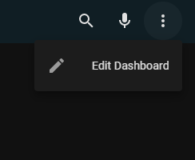
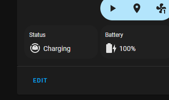
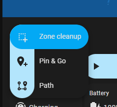
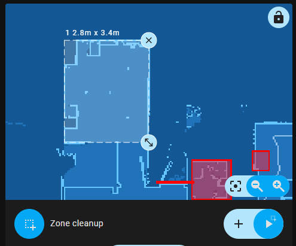
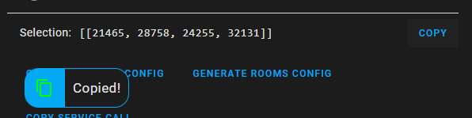

# Setup Platforms

The purpose of setup platforms is to make it easier to retrieve coordinates for other platforms.

### Getting coordinates

To get coordinates of zone, point or outline you have to:
1. Open dashboard in edit mode

   
2. Open card editor

   
3. Choose appropriate setup platform according to platform you use in card
   <table>
     <tbody>
       <tr>
         <th>Setup integer</th>
         <th>Setup decimal</th>
       </tr>
       <tr>
         <td valign="top">
           <ul>
             <li>Xiaomi Miio (default)</li>
             <li>al-one/hass-xiaomi-miot</li>
             <li>rand256/ValetudoRE</li>
             <li>Hypfer/Valetudo</li>
             <li>send_command</li>
             <li>Neato</li>
             <li>Roomba</li>
             <li>Tasshack/dreame-vacuum</li>
           </ul>
         </td>
         <td valign="top">
           <ul>
             <li>KrzysztofHajdamowicz/miio2</li>
             <li>marotoweb/viomise</li>
             <li>tykarol/viomi-vacuum-v8</li>
           </ul>
         </td>
       </tr>
     </tbody>
   </table>
4. Choose appropriate mode from dropdown according to desired shape
   * Zone -> "Zone cleanup"
   * Point -> "Pin & Go"
   * Outline -> "Path"

   
5. Mark a selection on a map

   
6. Copy selection coordinates using "Copy" button in editor

   
